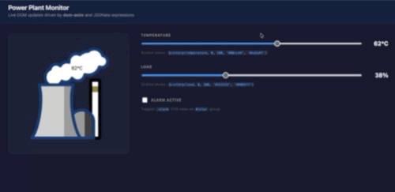

# Goals



Browsers have excellent support for SVG. Furthermore, SVG is an excellent medium
for engineering drawing, schematics and diagrams.

However, SVG's builtin animation functionality isn't really well suited for
animation of engineering systems because those animations are generally based on
some kind of data being streamed in (real world data, simulated results, _etc_)
whereas SVG animations tend to have all the data "baked into them".

So, what to do? Well, there are really two fundamental approaches.

## SVG Markup

The first approach (which I try to address
[here](https://github.com/mtiller/template-renderer), see
[demo](https://github.com/mtiller/template-renderer)). The problem with this
approach is that once you add the markup to the SVG, you can't really edit it
anymore with tools like Inkscape. Furthermore, approaches like
[this](https://en.wikipedia.org/wiki/Template_Attribute_Language) should, in
theory, allow you to edit the SVG but Inkscape (in particular) apparently
doesn't handle namespacing well enough.

## Injecting Values

An alternative approach is to leave the SVG completely alone. But if left alone,
how can we animate it since this means changing the SVG? The solution is to not
change the SVG image itself but rather to modify it once it is loaded into the
browsers DOM.

That is what this package does. This package assumes that you have some JSON
object that represents the current "data" you want to visualize. This could be
simulation results, information fed from sensors, whatever. The only restriction
is that this data be kept in an ordinary JSON object.

So the goal of this package is to map the information in the data object to
aspects of the SVG. Unlike the "markup" based approach, this mapping needs to
explain how fields from the data object make their way into the SVG.

### Mapping

The mapping itself is **declarative** which means you don't need to write any
Javascript code for this to work. You simply need to provide the mapping which
is itself just a JSON object. Each "key" in the mapping object tells us which
element we are going to modify and uses [CSS
selector](https://developer.mozilla.org/en-US/docs/Web/CSS/Guides/Selectors)
syntax. Each value in the JSON object is either an `Application` object or an
array of `Application` objects.

There are three types of application objects. Let's look at this example mapping
object to understand the various possibilities (this mapping comes from our
`demo` application):

```typescript
{
  // TextApplication is not natural for SVG, so we use two AttrApplications
  // and one ClassApplication here.

  // Accent band color: cool green when cold, alarm red when hot
  "#cloud": {
    to: "attr",
    attr: "fill",
    expr: "$cinterp(temperature, 0, 100, '#00cc44', '#ea5a47')",
  },

  // Outline stroke color: dark when idle, vivid blue at full load
  "#line path": {
    to: "attr",
    attr: "stroke",
    expr: "$cinterp(load, 0, 100, '#222222', '#0066ff')",
  },

  // Toggle the .alarm class on the color group to trigger a CSS animation
  "#color": {
    to: "class",
    name: "alarm",
    expr: "alarm",
  },

  "#temp": {
    to: "text",
    expr: "$string(temperature) & '°C'",
  },
}
```

The `to` field indicates what the change will be applied to. Options are:

- `class`: if the expression (`expr`) evaluates as "truthy", then the class will
  be added to the element(s) selected. Otherwise, the class will be removed.
- `attr`: evaluate the expression (`expr`) and replace the attribute (`attr`) on
  the selected element(s) with it.
- `text`: works like `attr` but replaces the text content of the selected
  element(s) with the result of evaluating the expression.

### Special Functions

This package binds two additional functions for use in the expressions.

The first is `$interp(v, vmin, vmax, ymin, ymax)`. The idea here is that `v` is
expected to be between `vmin` and `vmax`. The result of calling `$interp` is
that it will return a value between `ymin` and `ymax` based on where `v` is
between `vmin` and `vmax`. Mathematically, this is just:

```
$interp(v, vmin, vmax, ymin, ymax) = (ymax-ymin)*(v-vmin)/(vmax-vmin)+ymin
```

The second function this package provides is:

```
$cinterp(v, vmin, vmax, cmin, cmax)
```

...which is nearly identical **except** that `cmin` and `cmax` are **colors**.
These colors can be specified in pretty much any form allowed by CSS (including
alpha channels!). The result is that the output color returned by `$cinterp`
will be linearly interpolated in exactly the same way as it is for `$interp`.

This makes it very easy to make colors in an SVG depend on input signals.

# Conclusion

The bottom line is that this is a pure Javascript way of connecting attributes
of an SVG (or HTML in general) to data coming from any source. It keeps the SVG
pristine (_e.g.,_ so it could easily be updated or swapped with a different
SVG). The mappings are completely declarative so you don't need to add any
additional Javscript beyond the mapping. To the greatest extent possible, it
leverages existing, well established and well documented specifications or
standards for everything.

## Caveats

All expressions are evaluated as [JSONata](https://jsonata.org/) expressions.

This library is not limited to SVGs. That is a common use case but it works
equally well for **anything in the DOM**.

If you want to apply changes to a static SVG (_i.e.,_ one not loaded into the
browser's DOM), you can do that as well. Just use the `createStringProcessor`
function.
